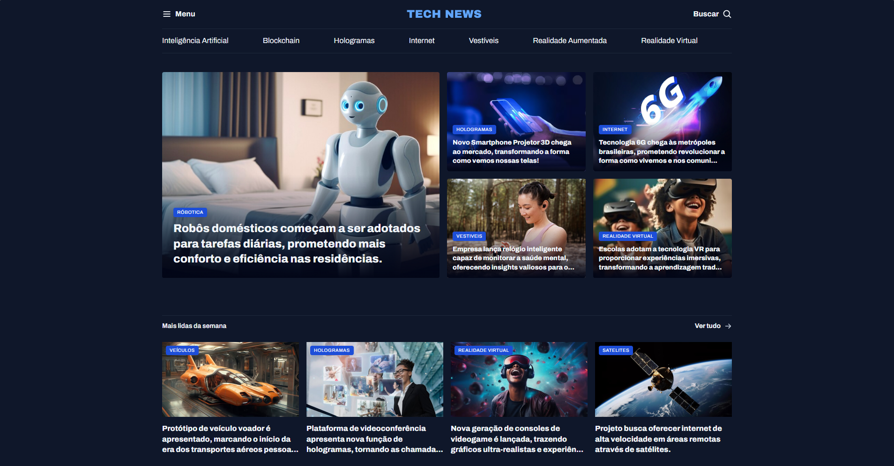

# News Portal

News portal project developed during studies.



## About

This project is a simple web page presenting a news portal focused on technology. The page displays news about Artificial Intelligence, Blockchain, Holograms, Internet, Wearables, Augmented Reality, and Virtual Reality, with a modern layout organized into featured sections.

## Tech Stack

- HTML
- CSS

## Design

- [Figma](https://www.figma.com/design/DyZAxfRYj5qlVxuqu9AOD3/Portal-de-not%C3%ADcias--Community-?m=auto&t=HMF6kf1r1gTF1Axq-6)

## How to run

```bash
# Clone this repository
git clone https://github.com/sillasemanoel/study-news-portal.git

# Enter the project folder
cd study-news-portal

# Open the index.html file in your browser
```

## Author

Sillas Emanoel
